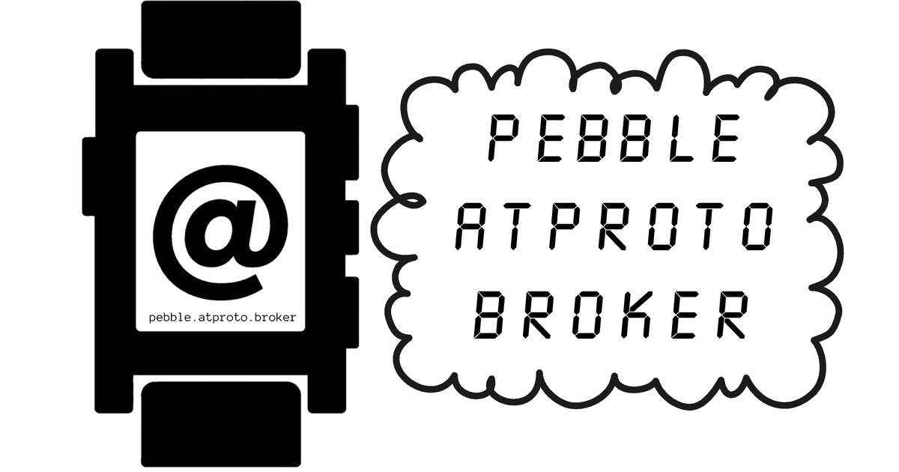

# Pebble atproto broker

Holds an AT Protocol OAuth session for a Pebble watch, so the watch can publish
records without holding your password or tokens.

## Used by

[](https://apps.repebble.com/f70991dc45774994abe6d832)

**[Catapult](https://apps.repebble.com/f70991dc45774994abe6d832)** publishes any
atproto record, in any lexicon, from your Pebble. It uses this broker for OAuth
and for permissioned spaces.

## Why it exists

A Pebble app's phone-side code runs in the PebbleKit JS sandbox, which has no
WebCrypto. AT Protocol OAuth needs an ES256 DPoP proof on every request, and a
settings page that runs from a `data:` URL has no origin to redirect back to.
So the sandbox cannot do OAuth.

The broker does it instead. The phone holds a device token; the OAuth tokens
and the DPoP key stay in the broker.

OAuth is also what permissioned spaces need. A space write is authorised by a
space scope, which an app password cannot carry.

## Use ours

A public instance runs at **https://pebble.atproto.broker**, and Catapult uses
it by default. Anyone can sign in with their own account. Sessions are stored
per DID, so no account can reach another's.

## Deploy your own

[](https://deploy.workers.cloudflare.com/?url=https://github.com/sriganesh/pebble-atproto-broker)

The button needs a GitHub or GitLab account. It copies this repository there,
creates the Worker and its Durable Objects in your Cloudflare account, and
redeploys whenever you push to the copy. It asks for one secret:

- **`STORAGE_KEY`**: 32 random bytes that encrypt what the broker stores.
  Make one with `openssl rand -base64 32`. Changing it later signs everyone
  out, and replaces the signing key if the Worker generated it.

The client signing key is made on first use, and the public URL defaults to
the address the Worker is reached on.

Or from the command line, with no Git connection:

```sh
npm install
npx wrangler secret put STORAGE_KEY
npm run deploy
```

Then open your Worker's URL, sign in, and it shows you a code. In your app's
settings, add an account, choose **OAuth via a broker**, enter your Worker's URL
under **Use a different broker**, and enter the code.

### Optional settings

Set these as secrets with `npx wrangler secret put NAME`, so a redeploy keeps
them:

| Name | What it does |
|---|---|
| `PUBLIC_URL` | Your public address. Set it when you add a custom domain. |
| `CONTACT_EMAIL` | Shown on the privacy page. |
| `ALLOWED_DIDS` | Only these accounts can sign in. Space- or comma-separated. |
| `CLIENT_PRIVATE_JWK` | Your own signing key. `npm run keygen` makes one. |

Set `PUBLIC_URL` as soon as the Worker has a custom domain. It is the OAuth
`client_id`, so a session started on one address and refreshed on another is
refused with `invalid_grant`.

## Permissions

The sign-in page lets you name the collections the broker may write to:

| You choose | It asks for |
|---|---|
| nothing | `atproto` `repo:*?action=create` |
| `app.bsky.feed.post` | `atproto` `repo:app.bsky.feed.post?action=create` |
| several collections | `atproto` plus one `repo:<nsid>?action=create` each |
| spaces ticked | adds `space:*?authority=*&collection=*&action=create&action=update&action=delete` |

In your repo it asks only to create records. With spaces ticked it can also
update and delete records in spaces. It never asks to read, or for account or
identity access.

The chosen collections are part of the `client_id`
(`/oauth-client-metadata.json?collections=...`), sorted and de-duplicated so
the same choice always produces the same URL.

Spaces are opt-in because a server without spaces support refuses a sign-in
that asks for a `space:` scope.

## Removing your account

- **From the app.** *Sign out of broker* in the account's settings.
- **From the web.** Open `/forget` and sign in to confirm the account is yours.

Both revoke the broker's access at your provider, then delete your devices and
your session. If the provider does not answer, the broker deletes everything
anyway and tells you to remove it from your account settings as well.

## Security

Sessions, device tokens, sign-in codes, pending logins and the generated
signing key are encrypted with AES-256-GCM before they are stored, using
`STORAGE_KEY`. Wrong-code counts and expiry times are not encrypted; they hold
no account information. Storage keys never contain a token or an IP address. A
value that fails to decrypt is treated as missing, and the user signs in again.

Sign-in codes are 40 bits and single use. `/api/pair` also blocks an address
after ten wrong codes in ten minutes.

Pending logins, sign-in codes and removal requests are single use and expire
after ten minutes.

Removing an account increments a counter, so a device token from before the
removal can never sign in again.

## Routes

| Route | Method | Purpose |
|---|---|---|
| `/` | GET | Sign-in page |
| `/oauth-client-metadata.json` | GET | Client metadata. This URL, with its query string, is the `client_id`. |
| `/jwks.json` | GET | Public half of the signing key |
| `/login?handle=` | GET | Start sign-in |
| `/callback` | GET | Finish sign-in and show a code |
| `/forget` | GET | Remove your account |
| `/privacy` | GET | Privacy and terms |
| `/api/pair` | POST | `{code}` → `{token, did, handle, pds}` |
| `/api/whoami` | GET | Which account a device token belongs to |
| `/api/post` | POST | `{collection, record, rkey?, space?, validate?}` |
| `/api/unpair` | POST | Revoke the calling device |
| `/api/forget` | POST | Revoke at the provider and delete everything for this account |

Every `/api` route except `/api/pair` needs `Authorization: Bearer <device
token>`. No route uses cookies, so any origin may call the API. The Pebble
settings page needs that, because it sends `Origin: null`.

## Storage

Two Durable Object classes:

**`PebbleBrokerAccount`**, one per account:

| Entry | Kept | Contents |
|---|---|---|
| `session` | until removed | Access and refresh tokens, DPoP key, PDS, issuer |
| `devices` | until revoked | Each device by a hash of its token |
| `generation` | always | The removal counter |

**`PebbleBrokerCell`**, one per short-lived item:

| Item | Kept | Contents |
|---|---|---|
| `pending:<state>` | 10 min | A sign-in in progress |
| `pair:<code>` | 10 min | The account a code belongs to |
| `remove:<token>` | 10 min | A confirmed identity waiting to be removed |
| `rate:<hash>` | 10 min | Wrong codes from one address |

## Development notes

- A DPoP proof's `htu` must have no query string or fragment.
- Every authorization server asks for a nonce on the first request.
  `postWithDpop` retries once with it.
- Refresh tokens rotate. `refreshSession` always stores the new one.
- `verifySubject` checks that the returned DID's PDS and issuer match the
  sign-in.
- `/jwks.json` serves only the public half of the key.

`npm test` runs the suite.
